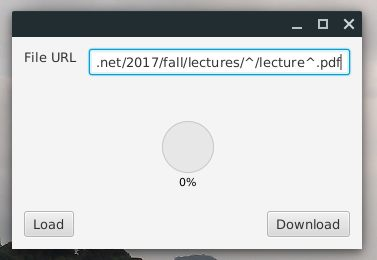
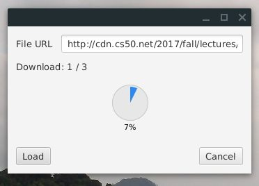
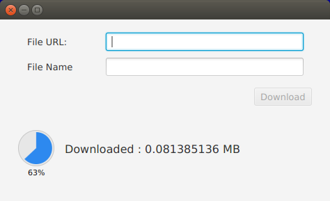

# Sequence Downloader
Download file sequences in an easy manner.

It works by substituting a special character in a link (`^`) by a set
of values that you store in a file. 
Each line of the file will have values separated by a *space* or a *tab* 
that will substitute the special character in the link

*Example*
Say that you want to download the first 3 lectures from [CS50](http://cs50.tv/) when you visit the website. The lecture PDF link will look something like the following.

```text
http://cdn.cs50.net/2017/fall/lectures/0/lecture0.pdf
```

We can notice that `0` indicates the lecture number. If want to guess the other PDF links for the first 3 lectures, it'll look like the following
```markdown
http://cdn.cs50.net/2017/fall/lectures/0/lecture0.pdf
http://cdn.cs50.net/2017/fall/lectures/1/lecture1.pdf
http://cdn.cs50.net/2017/fall/lectures/2/lecture2.pdf
```
The program will generate this pattern for us and perform the download.
The input link will look like this

*(note that by default `^` is an invalid URL character)*

```markdown
http://cdn.cs50.net/2017/fall/lectures/^/lecture^.pdf
```


This is the subtitution text file (e.g. `subs.txt`)

```text
0 0
1 1
2 2
```

After clicking `Download` the links will be generated and then downloaded.



> The `example` directory includes the used files, you can try them directly 

#### Other features
- You can use a default starting URL. the file **must** be named `default_link.txt`
- You can directly download files given a direct link also. (without using templates)


---
This project is a fork of [JavaFxWorkshop_06](https://github.com/mhrimaz/JavaFXWorkshop_06)

# Author README

**K.N. Toosi University of Technology JavaFX Workshop 6**
In this part you will learn how concurrency works in JavaFX and you will develop a simple download manager with JavaFX Task class to manage such a lengthy job in your program.
You can see the programm in the screenshot


